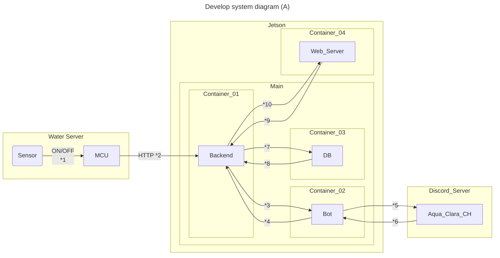

# clara-bot
定期的にAPIリクエストを行い、ボトルステータスが`false`であることを検知した場合にDiscordの指定されたチャンネルにボトル状況を投稿するDiscord Botです。`42_done`のリアクションを検知するとボトル交換者と交換までの時間を投稿し、対応したユーザー情報をデータベースへ格納します。全てが終了後、再び次のボトルステータスを問い合わせます。

## シンプルな実行
このプロジェクトを使用するには、Node.jsがシステムにインストールされている必要があります。また、`pnpm`または`npm`を使用して依存関係を管理します。

### インストール手順
1. このリポジトリをクローンします。
    ```bash
    git clone https://github.com/tmyuu/clara-bot.git
    cd clara-bot
    ```

2. `src`ディレクトリ内で依存関係をインストールします。
    ```bash
    cd src
    pnpm install # または npm install
    ```

3. `.env.sample`ファイルをコピーして`.env`ファイルを作成し、適切なトークンを記入します。
    ```bash
    cp .env.sample .env
    ```

4. ボットを実行します。
    ```bash
    node bot.js
    ```

# 機能

- 定期的にGETリクエストを行い、ボトルステータスの変更を検知します。
- ボトルステータスが`false`になった場合、Discordの任意のチャンネルに投稿します。
- `42_done`のリアクションを検知するとボトル交換者と交換までの時間を投稿し、対応したユーザー情報をPOSTリクエストします。

## 要件
* 水タンクが**"空"**の状態を検知する。
* Botがイベント発生時（水タンクの状態が**"飲料可"**から**"空"**に変わったとき）に特定のDiscordサーバーのチャンネルでメッセージ送信することと、そのチャンネル内でメッセージ検知と書く情報の更新すること。
* Webブラウザからタンクの状態（**"飲料可"** or **"空"**）や現在のタンク在庫数（**最大50本**）やタンク交換したユーザーの情報を確認できる。

## Botが検知するDiscordメッセージとその処理内容
* **"/charged user_name"**のメッセージを検知して、タンクの状態を**"飲料可"**にすること。
* **"/restock n"**のメッセージを検知して、**"校舎在庫"**の値をその値に更新すること。
* **"/reset"**のメッセージを検知して、**"制限数/月"**を**50**に更新すること。


## システムの分担

| No. | **内容**                     | 機器         | 担当                        |
| :-- | :------------------------- | :--------- | :------------------------ |
| 1.  | **水槽水位検知センサー**             | 電子回路       | kamitsui                  |
| 2.  | **WiFi 機能を備えたマイクロコントローラー** | マイコン       | kamitsui                  |
| 3.  | **サーバー バックエンド**            | Jetson \*1 | ymatui, kamitsui, ryozuno |
| 4.  | **データベース**                 | Jetson \*1 | ?                         |
| 5.  | **Discord ボット**            | Jetson \*1 | ymatsui                   |
| 6.  | **Web インターフェイス**           | Jetson \*1 | ryozno                    |

 \*1　実験時はJetsonで、運用時は42Tokyoサーバーを使えたら嬉しい。

## Mermaid


## 貢献

プロジェクトへの貢献に興味がある方は、プルリクエストを送るか、[x](https://x.com/livspect)から連絡してください。


